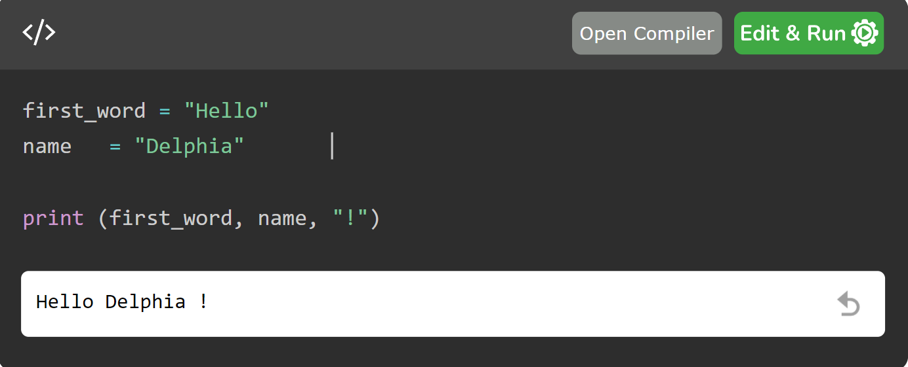

## Review Aplikasi Tutor, Tool, dan Tutee: Tutorials Point

Nama        : Delphia Aryana

NIM         : 2110131220012

Mata Kuliah : Pembelajaran Berbantuan Komputer

<h1 align="center">Tutorials Point</h1>

Tutorials Point adalah platform pembelajaran online yang menyediakan berbagai materi pembelajaran, panduan, dan tutorial dalam berbagai disiplin ilmu, mulai dari pemrograman, data science, desain, hingga keterampilan profesional lainnya. Aplikasi ini dirancang untuk mendukung pembelajaran mandiri dengan menawarkan konten yang mudah diakses dan berkualitas tinggi.

### Apa saja yang dapat dipelajari pada Tutorials Point?

Di Tutorials Point, pengguna dapat mempelajari berbagai topik mulai dari bahasa pemrograman seperti Python, Java, dan C++, hingga konsep teknologi seperti data science, machine learning, dan big data. Selain itu, aplikasi ini juga menawarkan kursus dalam desain grafis, pengembangan web, dan lain-lain. Pengguna juga dapat belajar tentang basis data, pengembangan aplikasi mobile, serta topik-topik lain yang terkait dengan teknologi dan ilmu komputer. Berikut adalah topik-topik yang dapat dipelajari pada tutorials Point.

 

## As a Tutor

Sebagai tutor, Tutorials Point berfungsi sebagai sumber daya pendidikan yang komprehensif. Aplikasi ini menyediakan tutorial langkah demi langkah, penjelasan konsep yang jelas, dan contoh praktis untuk membantu pengguna memahami topik tertentu. Kontennya dikemas dalam format teks, video, dan interaktif yang memungkinkan pengguna belajar sesuai dengan gaya belajar mereka. 

Tutorials Point memberikan materi secara terurut berupa langkah-langkah atau disebut juga dengan tutorial. Seperti contoh pada gambar di atas merupakan salah satu halaman untuk mempelajari HTML, pada sidebar, terdapat sub-sub materi yang bisa dipelajari pengguna secara terurut.

 

## As a Tool

* Sebagai tool, Tutorials Point menyediakan alat bantu belajar seperti compiler online untuk berbagai bahasa pemrograman, editor kode, dan simulator. Fitur ini memungkinkan pengguna untuk langsung mencoba kode atau konsep yang baru dipelajari tanpa harus meninggalkan aplikasi. Selain itu, ada juga kalkulator, konverter, dan alat pendukung lainnya yang memudahkan proses belajar dan praktik.

* Pada contoh di atas, terdapat editor kode untuk menjalankan program python. Sehingga pengguna dapat langsung mencoba menuliskan kode dan menjalankannya saat mempelajari materi.

 

## As a Tutee

Dalam Tutorials Point, pengguna menulis kode untuk menginstruksikan komputer melakukan tugas tertentu. Pengguna belajar cara mengajar komputer untuk menjalankan perintah melalui bahasa pemrograman yang dipelajari, sehingga komputer berperan sebagai murid yang diprogram oleh pengguna.

