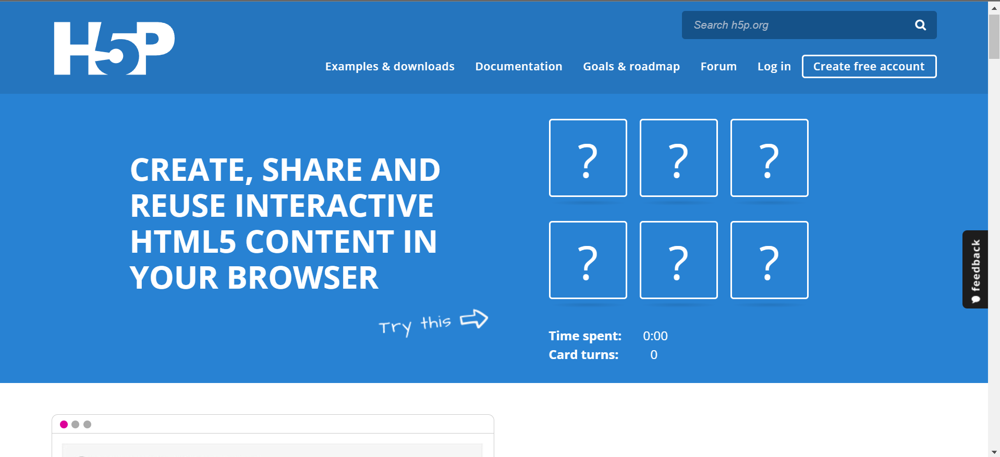

## Review Aplikasi Open Source H5P

Nama        : Delphia Aryana

NIM         : 2110131220012

Mata Kuliah : Pembelajaran Berbantuan Komputer

<h1 align="center">H5P</h1>

## 1. Deskripsi Singkat  
H5P (HTML5 Package) adalah platform berbasis open-source yang dirancang untuk membuat, berbagi, dan menggunakan konten interaktif di berbagai perangkat. Aplikasi ini memungkinkan pengguna dari berbagai tingkat keahlian, baik pendidik, pelatih, maupun pengembang, untuk menciptakan elemen pembelajaran menarik seperti video interaktif, kuis, simulasi, atau konten multimedia lainnya.  

H5P mendukung integrasi dengan sistem manajemen pembelajaran (LMS) populer seperti Moodle, WordPress, Drupal, dan Canvas, sehingga memperluas fungsionalitasnya di lingkungan pembelajaran digital.

---

## 2. Fitur Utama H5P  
Berikut adalah fitur utama yang menjadikan H5P unggul dalam pembuatan konten interaktif:  

1. **Jenis Konten Interaktif Beragam:**  
   - **Quiz:** Termasuk multiple choice, drag-and-drop, fill-in-the-blanks, dan lainnya.  
   - **Video Interaktif:** Memungkinkan penambahan hotspot, pertanyaan, dan tautan dalam video.  
   - **Course Presentation:** Presentasi interaktif dengan elemen dinamis.  
   - **Flashcards:** Untuk penghafalan cepat dan pembelajaran ulang.  
   - **Interactive Book:** Menggabungkan berbagai jenis media dalam format buku interaktif.  

2. **Responsif dan Kompatibel:**  
   Konten yang dibuat kompatibel dengan berbagai perangkat (PC, tablet, smartphone) tanpa memerlukan adaptasi tambahan.  

3. **Open Source:**  
   Pengguna dapat mengakses dan memodifikasi kode sumber, memungkinkan pengembang untuk menyesuaikan sesuai kebutuhan.  

4. **Integrasi LMS:**  
   - Dukungan integrasi tanpa hambatan dengan Moodle, WordPress, dan Canvas.  
   - Memungkinkan penggunaan langsung di platform LMS tanpa perlu memindahkan konten.  

5. **Analytics:**  
   Memanfaatkan Learning Record Store (LRS) untuk mengumpulkan data pengguna, sehingga pendidik dapat memantau progres dan performa siswa.  

6. **Cloud Hosting (H5P.com):**  
   Versi premium yang menyediakan hosting berbasis cloud untuk mempermudah penyimpanan dan distribusi konten.  

---

## 3. Kelebihan H5P  
1. **Antarmuka Sederhana dan User-Friendly:**  
   Pengguna dapat dengan mudah membuat konten tanpa memerlukan keterampilan teknis seperti coding.  

2. **Ekosistem Kolaboratif:**  
   Fitur berbagi mempermudah kolaborasi dalam pembuatan konten antar pengguna.  

3. **Efisiensi Waktu dan Biaya:**  
   Proses pembuatan konten yang cepat dan efisien tanpa biaya tinggi untuk alat atau perangkat lunak tambahan.  

4. **Dukungan Komunitas:**  
   Komunitas pengguna yang luas memberikan dokumentasi, forum bantuan, dan tutorial yang beragam.  

5. **Berbasis Web dan Cloud:**  
   Tidak memerlukan instalasi perangkat lunak; cukup dengan browser web.  

6. **Gratis (Dasar):**  
   Semua fitur dasar tersedia secara gratis, ideal untuk pengguna dengan anggaran terbatas.  

---

## 4. Kekurangan H5P  
1. **Kustomisasi Visual Terbatas:**  
   Desain elemen interaktif memiliki template yang relatif standar, sehingga tidak terlalu fleksibel untuk memenuhi kebutuhan desain unik.  

2. **Keterbatasan Proyek Kompleks:**  
   Untuk proyek dengan elemen interaktivitas kompleks seperti game berbasis pembelajaran atau simulasi tingkat lanjut, H5P mungkin tidak mencukupi.  

3. **Fitur Premium Berbayar:**  
   Untuk hosting cloud H5P.com, pengguna harus membayar biaya langganan.  

4. **Ketergantungan pada LMS:**  
   Meskipun H5P mandiri, integrasi penuh membutuhkan platform seperti Moodle atau WordPress.  

5. **Tantangan dalam Manajemen Konten Besar:**  
   Ketika digunakan untuk skala besar, pengelolaan konten dalam H5P bisa menjadi tantangan tanpa struktur LMS yang mendukung.  

---

## 5. Penerapan H5P dalam Berbagai Bidang  
1. **Pendidikan:**  
   - Membuat kuis interaktif untuk evaluasi pembelajaran.  
   - Video interaktif untuk memandu siswa memahami topik yang kompleks.  
   - Buku interaktif untuk pembelajaran mandiri.  

2. **Pelatihan Korporasi:**  
   - Modul pelatihan karyawan berbasis LMS.  
   - Simulasi atau skenario kerja interaktif untuk pelatihan praktik langsung.  

3. **E-learning dan Kursus Daring:**  
   - Peningkatan pengalaman pembelajaran daring dengan elemen dinamis.  

4. **Pemasaran dan Branding:**  
   - Membuat konten interaktif seperti survei atau kuis untuk menarik audiens.  

---

## 6. Perbandingan dengan Alternatif  
H5P bersaing dengan alat-alat serupa seperti Articulate Storyline, Adobe Captivate, dan iSpring. Dibandingkan alat-alat tersebut:  
- **Keunggulan:** Gratis, mudah digunakan, berbasis open-source.  
- **Kekurangan:** Tidak memiliki tingkat kustomisasi visual dan kemampuan pembuatan konten tingkat lanjut seperti simulasi berbasis 3D.  

---

## 7. Kesimpulan  
H5P adalah solusi luar biasa untuk membuat konten interaktif berbasis web yang sederhana namun efektif. Ideal untuk pendidik, pelatih, dan perusahaan yang mencari alat untuk menyampaikan materi dengan cara yang menarik dan responsif. Meski terdapat keterbatasan dalam desain dan kompleksitas, kemudahan penggunaannya serta opsi gratis menjadikannya salah satu pilihan terbaik di kelasnya.  

### **Rekomendasi:**  
- Cocok untuk pemula dan pengguna menengah.  
- Pengguna yang membutuhkan fitur tingkat lanjut atau kustomisasi penuh mungkin memerlukan alat tambahan seperti Articulate Storyline atau Adobe Captivate.
